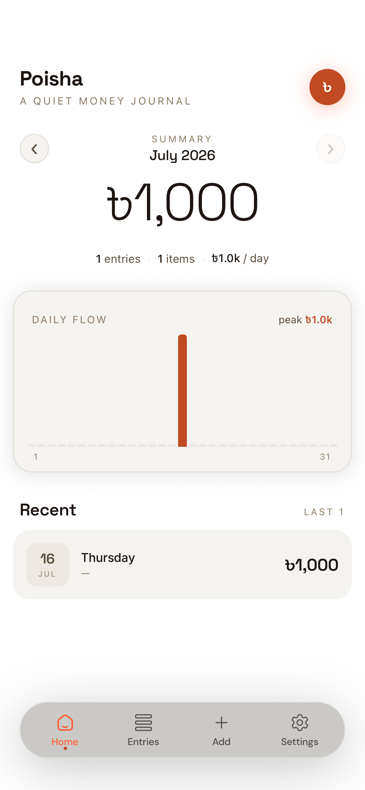
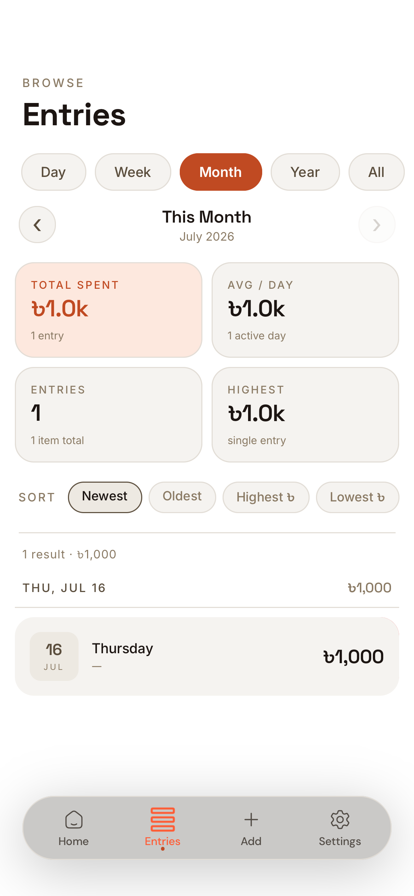
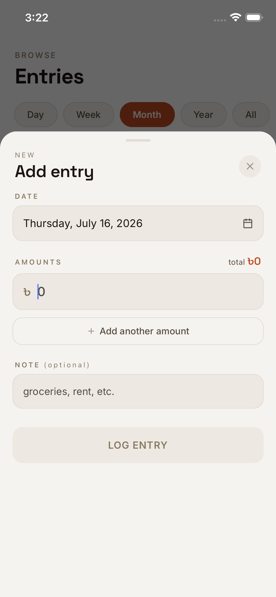
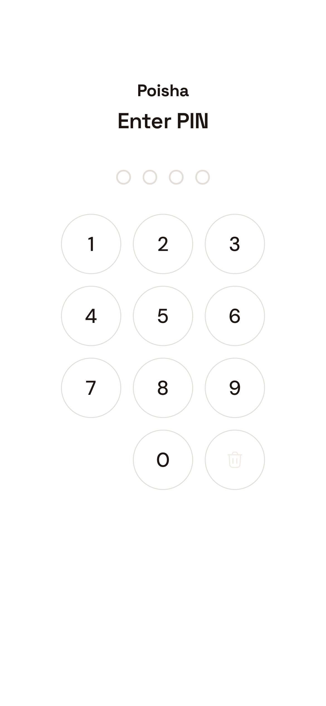
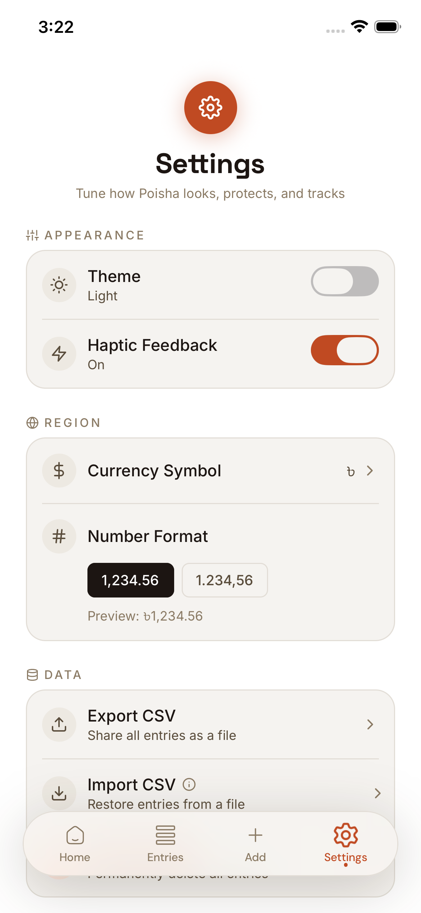
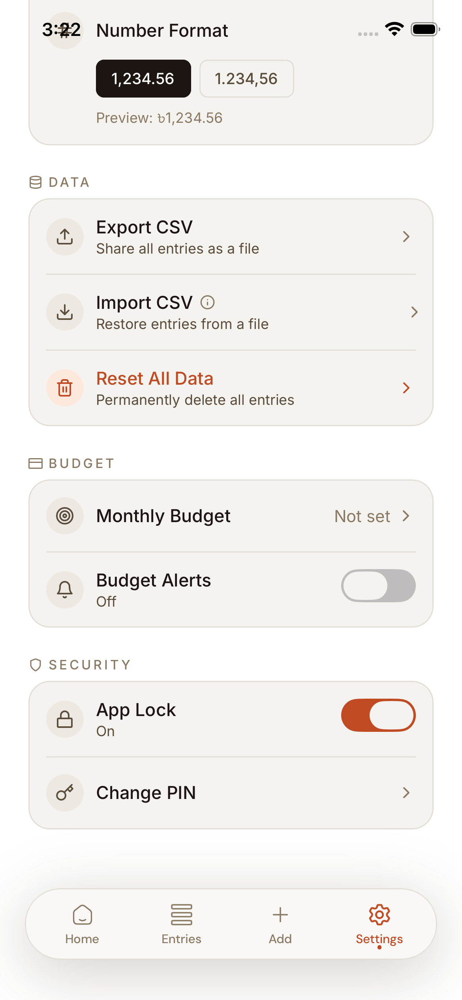

# Poisha 💸

> *a quiet money journal*

Poisha is a personal expense-tracking app built with [Expo](https://expo.dev) and [Expo Router](https://docs.expo.dev/router/introduction/). It runs on iOS, Android, and web from a single TypeScript codebase, with all data stored locally on-device.

## Features

- **Entry management** — log expenses with multiple amount line-items per entry, an optional note, and a date picker
- **Plan Mode** — opt in from Settings › Planning (off by default) to schedule future-dated expenses (rent, a subscription). A future entry is held as *planned*: excluded from every spend total, chart, and budget figure until its date arrives, then counted automatically. Surfaced in an Upcoming section on Home and an Upcoming filter on Browse. With Plan Mode off the date picker caps at today and the app behaves exactly as it did before the feature
- **Home dashboard** — monthly hero total, entry/item stats, a custom daily spending bar chart, and recent entries
- **Browse screen** — full entry list grouped by date, with Day/Week/Month/Year/All period filters, a date-range navigator, stats grid, and sort controls
- **App lock** — mandatory PIN onboarding, SHA-256 salted PIN storage in `expo-secure-store`, 5-attempt lockout with cooldown, and optional Face ID / Fingerprint unlock
- **CSV import & export** — export all entries to CSV via the native share sheet, or import from a CSV file with a merge-or-replace flow
- **Budget tracking** — set a monthly budget with a progress indicator on the home screen
- **Light & dark themes** — toggle in Settings, persisted across launches
- **Currency & locale settings** — configurable currency symbol and number formatting
- **Notifications** — daily reminders via `expo-notifications`
- **Haptics** — tactile feedback across key interactions
- **Swipe to delete** — swipe an entry card to remove it without opening the edit sheet

See [docs/FEATURES.md](docs/FEATURES.md) for the full feature inventory and roadmap, and [docs/ISSUES.md](docs/ISSUES.md) for known issues.

## Screenshots

| Home | Browse | Add entry |
|---|---|---|
|  |  |  |

| PIN lock | Settings | Settings (data & security) |
|---|---|---|
|  |  |  |

## Tech stack

- [Expo SDK 57](https://docs.expo.dev/) + [Expo Router v6](https://docs.expo.dev/router/introduction/) (file-based routing, typed routes)
- React 19 / React Native 0.86, New Architecture enabled
- [NativeWind](https://www.nativewind.dev/) (Tailwind CSS for React Native)
- [TanStack Query](https://tanstack.com/query) for data/state management
- [`expo-sqlite`](https://docs.expo.dev/versions/latest/sdk/sqlite/) as the local database (migrated from AsyncStorage)
- [`expo-secure-store`](https://docs.expo.dev/versions/latest/sdk/securestore/) for PIN storage
- [`react-native-reanimated`](https://docs.swmansion.com/react-native-reanimated/) + Gesture Handler for animations and gestures
- [Zod](https://zod.dev/) for schema validation
- [Bun](https://bun.sh/) as the package manager
- TypeScript throughout, strict mode

## Project structure

```
app/                      Expo Router routes
  (tabs)/                 Tab navigator: home, browse, settings
  _layout.tsx             Root layout — fonts, providers, lock gate, add-entry sheet

lib/
  components/             Feature components (entry cards, sheets, PIN screens, ...)
  context/                 React context providers (lock state, sheet state)
  hooks/                   Reusable hooks (entries, budget, locale, theme, biometrics, ...)
  services/                Data-access layer, one folder per domain (entries, pin, budget, ...)
  storages/                Storage adapters (SQLite, SecureStore, AsyncStorage)
  ui/                      Low-level UI primitives (button, card, input, bottom sheet, date picker)
  schemas/                 Zod schemas
  types/                   Shared TypeScript types
  constants/               Theme, locale, storage key, and query key constants
  config/                  Env, error, and query-client configuration
  utils/                   Formatting, date, CSV, and other pure helpers

docs/                      Feature specs and known issues
```

Naming convention: files are suffixed by role (`*.component.tsx`, `*.hook.ts`, `*.service.ts`, `*.util.ts`, `*.types.ts`, etc.).

## Getting started

1. Install dependencies

   ```bash
   bun install
   ```

2. Start the app

   ```bash
   bun start
   ```

   In the output, you'll find options to open the app in a [development build](https://docs.expo.dev/develop/development-builds/introduction/), [Android emulator](https://docs.expo.dev/workflow/android-studio-emulator/), [iOS simulator](https://docs.expo.dev/workflow/ios-simulator/), or [Expo Go](https://expo.dev/go).

   Since this project uses native modules (SQLite, SecureStore, notifications, local authentication), a [development build](https://docs.expo.dev/develop/development-builds/introduction/) is recommended over Expo Go for full functionality.

## Scripts

| Command | Description |
|---|---|
| `bun start` | Start the Metro dev server |
| `bun run android` | Build and run on a connected Android device/emulator |
| `bun run ios` | Build and run on an iOS simulator/device |
| `bun run lint` | Lint the project with the Expo ESLint config |
| `bun run build:apk` | Build an Android APK locally via EAS (`local` profile) |
